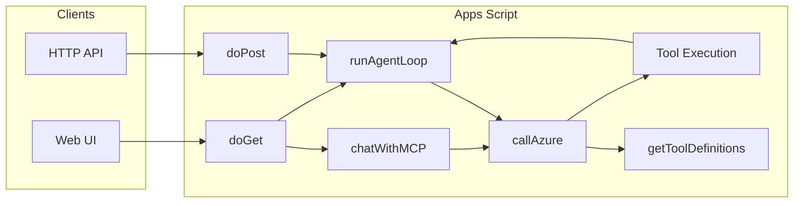

# Google Apps Script MCP-Style Server — Project Description

## Overview

This project runs as an API-first architecture with Node.js as the orchestrator and Apps Script as a Google Workspace tool bridge. There is no external MCP SDK—"MCP-style" means the pattern of tool definitions plus an agent loop that calls the LLM and runs tools.

---

## Architecture



- **Entry points:** `doPost(e)` for API bridge requests and `doGet(e)` for a deprecation message in API-only mode.
- **Chat endpoint:** `chatWithMCP(messages)` powers the Web UI “Chat with MCP” experience. It accepts full conversation history (array of `{ role, content }`), runs the same agent loop (Azure + tool execution), and returns `{ reply, finalResult? }` so the client can show the assistant’s reply and optionally a deck link. When the assistant asks for more information (content only, no tool calls), it returns immediately so the user can reply; the next request includes the full history so the agent remembers context.
- **Agent loop:** Agent orchestration now runs in the Node backend. Apps Script handles Google tool execution only.
- **Tool definitions and implementations** live in [Code.js](Code.js): definitions in `getToolDefinitions()` (lines 84–136), implementations in the script functions (lines 141–176).

---

## Tools

All tools are defined in `getToolDefinitions()` and implemented in [Code.js](Code.js).

| Tool | Description | Parameters |
|------|-------------|------------|
| `findFileByName` | Finds a Google Drive file by name and returns its ID. | `fileName` (string, required) |
| `readDocContent` | Reads the body text of a Google Doc (for workload notes). | `fileId` (string, required) |
| `createNewWorkloadPresentation` | Copies the Telco NBM Slides template and replaces all placeholder tags with provided content. | `workloadName`, `client`, `notes` (required); `timeline`, `corporateObjectives`, `businessStrategy`, `itInitiatives`, `challenges`, `requiredCapabilities`, `currentSolution`, `futureState` (optional) |
| `addCalendarReminder` | Adds a reminder (short calendar event) to the user's default or a named/ID calendar; uses email/chat context for title and description; LLM resolves natural-language time to ISO startTime. | `title`, `startTime` (required); `description`, `durationMinutes`, `calendarName`, `calendarId` (optional) |
| `getNotesRootFolderId` | Returns the root folder ID for account/opportunity notes in Drive (configurable via Script Property `NOTES_ROOT_FOLDER_ID`). Call this first when listing workloads for an account or when resolving note locations. | (none) |
| `listSubfolders` | Lists direct subfolders of a Drive folder; returns `{ subfolders: [{ name, id }] }`. Use for matching account or opp names or navigating folder structure. When the user asks to list all workloads for an account, use `getNotesRootFolderId` then `listWorkloadsForAccount` instead. | `folderId` (string, required) |
| `resolveNotesLocation` | Finds where notes should go: account folder, Account > Opps > [Opp folder] > Notes, or Account > Workloads > [Workload folder]. Returns `notesFolderId` and `pathDescription`. If both `oppName` and `workloadName` are provided, `oppName` takes precedence. | `rootFolderId`, `accountName` (required); `oppName`, `workloadName` (optional) |
| `resolveWorkloadFolderWithSuggestions` | Resolves where a workload folder is or would be. Uses fuzzy search for account; for workload, a 90% string-similarity match is treated as confident. Does not create. Returns either a confident match (`notesFolderId`, `pathDescription`) or `match: "none"` with `proposedPath` and `existingWorkloads` so the user can confirm creating a new folder or adding to an existing one. Call `getNotesRootFolderId` first. For listing all workloads for an account (without a specific workload name), use `listWorkloadsForAccount`. | `rootFolderId`, `accountName`, `workloadName` (required) |
| `listWorkloadsForAccount` | Lists all workload folders for an account (under Account > Workloads). Use when the user asks to list, show, or enumerate all workloads for an account (e.g. "list all of the workload for an account", "list all workloads in a folder for an account", "what workloads does X have?"). Returns `{ workloads: [{ name, id }], pathDescription? }`. Call `getNotesRootFolderId` first. | `rootFolderId`, `accountName` (required) |
| `ensureWorkloadFolderAndNotes` | Creates the folder path Account > Workloads > [Workload] under the notes root if it does not exist, then finds or creates a notes document in that workload folder. New notes docs are named **&lt;Account&gt; - &lt;Workload name&gt; Notes Document** unless `preferredNotesName` is provided. **Only call after the user has confirmed the folder name and location.** Call `getNotesRootFolderId` first. | `rootFolderId`, `accountName`, `workloadName` (required); `preferredNotesName` (optional) |
| `getOrCreateNotesDoc` | In a folder, finds a doc named "Account Notes", "Notes", or preferredName, or creates one; returns `fileId`, `url`. | `folderId` (required); `preferredName` (optional) |
| `appendNotesToDoc` | Adds notes to a Google Doc. **Prepend defaults to true:** notes are inserted at the beginning with Heading 2 (`headingTitle`, or "Notes" if omitted), Heading 3 (date), then body. For opp or workload pass `prepend: false` to append at end with optional `sourceLabel`. | `fileId`, `notesText` (required); `sourceLabel`, `prepend`, `headingTitle` (optional) |
| `addTeamTodo` | Adds a to-do to the team to-do Doc under a section. Use `section` (enum) for built-in roles or `sectionLabel` for a custom section (section must already exist). Does not create new sections; use `createTeamTodoSection` after user confirms. | `taskText` (required); `section` or `sectionLabel`, `fileId` (optional) |
| `markTeamTodoDone` | Marks a team to-do done: finds the paragraph containing `taskText` in the section, moves it to the section's "**[Role] — Done**" block (creating that block if missing). Use `section` or `sectionLabel`. If no exact match, returns `needsConfirmation`, `suggestedTaskText`, and `availableTodos`—agent asks "Did you mean: [suggestedTaskText]?" and lists options; on confirmation retries with `taskText` set to `suggestedTaskText`. On success, returns `remainingTodos`; agent lists them afterwards as additional options. | `taskText` (required); `section` or `sectionLabel`, `fileId` (optional) |
| `listTeamTodoSections` | Lists existing section names (Heading 2) in the team to-do doc, excluding "— Done" blocks. Use before creating a new section so the agent can list options and ask whether to add to an existing section or create a new one. | `fileId` (optional) |
| `createTeamTodoSection` | Creates a new section (Heading 2) at the end of the team to-do doc. **Only call after the user has confirmed** they want a new section (e.g. for a new team member). The agent should call `listTeamTodoSections` first, list those sections, then ask; only on confirmation call this then `addTeamTodo`. | `sectionLabel` (required); `fileId` (optional) |
| `listTeamTodoOpen` | Lists all open (non-done) to-dos under a **specific section**. Returns `{ section, todos }`. Use `section` or `sectionLabel`. Only use this when the user explicitly mentions a section; otherwise use `listAllTeamTodosOpen`. | `section` or `sectionLabel`, `fileId` (optional) |
| `listAllTeamTodosOpen` | Lists open to-dos **across every section** in the team to-do doc. Returns `{ sections: [{ section, todos }] }`. Call this whenever the user asks to see their to-dos without specifying a section—do not ask which section first. | `fileId` (optional) |

**Team to-do sections:** Built-in enum: `me` | `account_development_reps` | `solutions_architects` | `scaled_solutions_architects` | `specialists`. Custom sections (e.g. new team member) are created with `createTeamTodoSection` only after the agent lists existing sections and the user confirms.

---

## Node CRM API behavior (Mongo tools)

For CRM entities (`accounts`, `workloads`, `contacts`, `taskLists`, `tasks`), the operational source of truth is the Node backend in [server/src/index.js](server/src/index.js). Apps Script remains the Google Workspace bridge; it is not the primary implementation for Mongo CRM mutation behavior.

### Contact deletion (Node Mongo tool)

| Tool | Description | Parameters |
|------|-------------|------------|
| `deleteContact` | Permanently deletes one contact; removes that id from every workload’s `contactIds` and embedded `contacts`, clears `reportsTo.contactId` on other contacts, then deletes the document. | `confirm` (boolean, required; must be `true` after explicit user confirmation). Target: `contactId` and/or `contactName`; optional `accountId` / `AccountId` to scope resolution when the same person exists on multiple accounts (use `listContacts` first if unsure). |

### Resolution and disambiguation

- Name-based resolution in Node uses a deterministic sequence:
  1. Exact-match pre-pass on selected fields (case-insensitive exact regex match),
  2. Hybrid fuzzy/text search fallback,
  3. Disambiguation response when multiple matches remain.
- Candidate windows for disambiguation are intentionally wider than the prior top-5 behavior to reduce false negatives from ranking noise.
- `updateWorkload` applies account-scoped name resolution when `accountId` is supplied, preventing same-name workloads in other accounts from being selected.

### Partial-success association behavior

- Association resolution for `contactIds`/`workloadIds` supports partial success:
  - valid IDs are applied,
  - unresolved IDs are returned in `warnings` with structured reasons,
  - operations fail only when all provided IDs fail to resolve.
- Typical warning reasons:
  - `invalid_id`
  - `not_found`
  - `account_mismatch`

### Update semantics (relationship safety)

- `updateWorkload` relationship semantics are explicit:
  - omitted `contactIds` means no change to existing associations,
  - `clearContacts=true` explicitly clears associations,
  - provided `contactIds` updates associations.
- Account-only updates no longer implicitly clear contact associations.

### Response compatibility contract

- Existing response keys are preserved for backward compatibility.
- New additive metadata may be returned:
  - `warnings` (array) on partial-success operations,
  - disambiguation payload (`needsDisambiguation`, `candidates`),
  - internal resolution metadata may be present in resolver paths.

### Workload stage rules

- Workload `stage` is a structured field separate from `description` and `notes`.
- Allowed `stage` values are exactly: `Research`, `Discovery`, `Scope`, `Technical Validation`, `Closed`.
- `addWorkload` defaults `stage` to `Research` when omitted.
- `addWorkload` / `updateWorkload` reject any `stage` outside the allowed values.

### Document link rules

- `accounts`, `workloads`, and `contacts` support `documentLinks` as an array of `{ name, url }`.
- `addAccount`, `addWorkload`, and `addContact` accept optional `documentLinks` on create.
- `updateAccount`, `updateWorkload`, and `updateContact` support:
  - `documentLinks` to replace all links,
  - `addDocumentLinks` to append links (deduped by URL).
- If a user provides only a raw URL without a document name, the assistant must ask what to call the document before saving.

### Response examples

Successful update, no warnings:

```json
{
  "ok": true,
  "workload": {
    "_id": "69cd...",
    "name": "PS - GLM Migration",
    "contactIds": ["69aa...", "69bb..."]
  }
}
```

Successful update with partial warnings:

```json
{
  "ok": true,
  "workload": {
    "_id": "69cd...",
    "name": "PS - GLM Migration",
    "contactIds": ["69aa..."]
  },
  "warnings": [
    {
      "id": "not-a-valid-id",
      "reason": "invalid_id",
      "message": "Invalid contactId: not-a-valid-id"
    }
  ]
}
```

Hard failure (all provided refs unresolved):

```json
{
  "error": "Unable to resolve any provided contactIds",
  "warnings": [
    {
      "id": "bad-id",
      "reason": "invalid_id",
      "message": "Invalid contactId: bad-id"
    }
  ]
}
```

### Regression tests and modification guidance

- Guard-matching behavior is covered in [server/test/workload-guards.test.js](server/test/workload-guards.test.js).
- CRM resolution/flow integration behavior is covered in [server/test/crm-resolution.test.js](server/test/crm-resolution.test.js).
- Integration tests may auto-skip when Mongo connectivity is unavailable in local/sandbox environments.
- Before changing CRM tool behavior, run Node tests in `server/`:
  - `npm test`

---

## Backend Protocols and Commands

### 1. Node REST API (`server/`) - primary backend protocol

The primary API is the Node service in `server/src/index.js`.

- **Base URL:** `http://localhost:8787` in local dev (or your cloud URL)
- **Auth:** `Authorization: Bearer <NODE_API_KEY>` when `REQUIRE_NODE_API_KEY=true` (recommended and enabled by default in `.env.example`)
- **Health check:**

```bash
curl -s http://localhost:8787/api/health
```

- **Chat:**

```bash
curl -s -X POST http://localhost:8787/api/chat \
  -H "Content-Type: application/json" \
  -H "Authorization: Bearer $NODE_API_KEY" \
  -d '{
    "conversationId": "conv_demo_1",
    "userId": "webUser_demo_1",
    "messages": [{ "role": "user", "content": "List workloads for Acme." }]
  }'
```

- **Workflow orchestration:**

```bash
curl -s -X POST http://localhost:8787/api/workflow \
  -H "Content-Type: application/json" \
  -H "Authorization: Bearer $NODE_API_KEY" \
  -d '{"docUrl":"https://docs.google.com/document/d/<DOC_ID>/edit","extraPrompt":"focus on migration blockers"}'
```

- **Read models for UX:**
  - `GET /api/tasks/open`
  - `GET /api/workloads`
  - `GET /api/accounts`
  - `GET /api/contacts`
  - `DELETE /api/contacts/:contactId`

- **Voice protocol:**
  - `POST /api/voice/transcribe` (`multipart/form-data`, `file` part)
  - `POST /api/voice/speak` (`application/json`, `{ "text": "..." }`)

### 2. Node -> Apps Script bridge protocol

Node calls the Apps Script Web App URL (`GAS_WEB_APP_URL`) using a bridge payload:

- `{"action":"getGoogleToolDefinitions","secret":"<NODE_TO_GAS_SECRET>"}`
- `{"action":"executeTool","tool":"<toolName>","args":{...},"secret":"<NODE_TO_GAS_SECRET>"}`

This isolates Google Workspace tool execution behind a shared secret and avoids exposing Apps Script internals to browser clients.

### 3. Apps Script Web App protocol (`Code.js`)

Apps Script `doPost(e)` supports bridge requests from Node and responds via `ContentService` JSON.

`doGet(e)` can still serve the Apps Script HTML workflow UI where needed, but cloud deployment should treat Node as the primary API surface.

### 4. Web UX protocol (`web-ux/`)

`web-ux/src/server.js` now proxies `/api/*` requests to `NODE_API_BASE_URL` server-side and injects `NODE_API_KEY` on the server.

- The browser no longer receives `NODE_API_KEY` in `/config.js`.
- This prevents credential leakage in client-side JavaScript while keeping UX behavior unchanged.

## Google Apps Script–Only Scope

The project uses only Apps Script built-in services:

- **DriveApp** — file search, copy template.
- **DocumentApp** — read Doc content.
- **SlidesApp** — open presentation, replace text.
- **CalendarApp** — create reminder-style events on default or named calendar.
- **UrlFetchApp** — call Azure OpenAI.
- **ContentService** — JSON response for `doPost`.
- **HtmlService** — serve the Web UI in `doGet`.

No external MCP client or server SDK is used. For full API references and guides, see [Apps Script Reference](https://developers.google.com/apps-script/reference) and [Apps Script Guides](https://developers.google.com/apps-script/guides).

---

## Cloud Security Readiness Checklist

Use this checklist before every cloud deployment:

1. **No hardcoded credentials in source**
   - `Code.js` and `appsscript-backend/Code.js` must use Script Properties for `AZURE_API_KEY`, `AZURE_ENDPOINT`, and `TEMPLATE_ID`.
   - Keep all Node secrets in runtime env/secret manager only.
2. **No credentials shipped to browser**
   - Web UX must not expose `NODE_API_KEY` in client config.
   - Keep credential injection server-side via `web-ux/src/server.js` proxy.
3. **API authentication enforced**
   - Set `REQUIRE_NODE_API_KEY=true` (default in `.env.example`) and configure `NODE_API_KEY` in cloud runtime.
4. **CORS restricted**
   - Set `CORS_ALLOWED_ORIGINS` to trusted origins only (comma-separated).
5. **Rotate any leaked or previously committed keys**
   - If a key was ever committed or shared in plaintext, revoke and replace it before go-live.
6. **Least privilege**
   - Use least-privilege MongoDB user credentials.
   - Keep Apps Script deployment access scoped to required users/apps.

---

## Local and Deploy Commands

### Node API (`server/`)

```bash
cd server
npm install
npm run check
npm test
npm start
```

Optional migrations:

```bash
cd server
npm run migrate:workloads:structured
npm run migrate:tasks:documents       # dry-run report
npm run migrate:tasks:documents:execute
```

Task model maintenance-window cutover:

1. Pause task writers (Node/API and Apps Script callers).
2. Run `npm run migrate:tasks:documents` and confirm counts/sample output.
3. Run `npm run migrate:tasks:documents:execute` to upsert standalone task docs and remove embedded `taskLists.tasks`.
4. Run `npm test` and smoke-check `GET /api/tasks/open`, `GET /api/dashboard/snapshot`, task create/update/delete flows.
5. Resume writers after validation passes.

Rollback:

- Restore `taskLists` from backup/export taken before step 3.
- Drop or archive newly written `tasks` docs for affected `taskListId`s.
- Redeploy previous server build if the cutover code is already live.

### Web UX (`web-ux/`)

```bash
cd web-ux
npm install
NODE_API_BASE_URL=http://localhost:8787 NODE_API_KEY=<same-as-server> npm start
```

### Apps Script / clasp

```bash
clasp login
clasp status
clasp push
clasp open
```

After `clasp push`, publish a new Apps Script web-app version from the Apps Script UI.

---

## Manual Setup and Configuration

Anything that cannot be done purely in code is listed here. Follow these steps in order.

### 1. Script / Web App deployment

1. Open the project in the [Apps Script editor](https://script.google.com) (or via clasp: `clasp open`).
2. **Deploy as Web app:** Click **Deploy** → **New deployment** → choose **Web app**.
3. Set **Execute as:**  
   - **User accessing the web app** — runs as the signed-in user (Drive/Docs/Slides under their account).  
   - **User who deployed** — runs as you; all callers see your Drive/data.  
   - Current default in [appsscript.json](appsscript.json) is `"executeAs": "USER_DEPLOYING"`.
4. Set **Who has access:**  
   - **Only myself** — only you can open the Web App URL or call the API.  
   - **Anyone** (or **Anyone with Google account**) — use for API or shared Web UI; choose the option that matches your security needs.
5. Click **Deploy**, copy the **Web app URL** for API and Web UI use.
6. **Test vs Production:** Use "Test" deployments during development (URL changes when you create a new Test deployment). Use "Manage deployments" to create or update a "Production" deployment with a stable URL.

**Updating the live Web app after code changes (e.g. from Cursor):** The URL serves a specific **version** of your script. After you change code locally:

1. **Push** the latest code to the Apps Script project: run `clasp push` in the project directory (from Cursor’s terminal or your own). That uploads [Code.js](Code.js), [Index.html](Index.html), etc., to the cloud project.
2. **Redeploy so the Web app uses the new code:** In the [Apps Script editor](https://script.google.com), go to **Deploy** → **Manage deployments**. Open the **pencil (Edit)** on your Web app deployment. Under **Version**, choose **New version** (to create a version from the current editor code — make sure you’ve refreshed or that the editor already has the pushed code), add a description if you like, then click **Deploy**. The same Web app URL will now serve the new version. If you use a **Test** deployment, run the project once from the editor (Run → Test) so the Test URL serves the latest code.
3. **Cache:** If you still see the old UI, do a hard refresh (e.g. Ctrl+Shift+R or Cmd+Shift+R) or open the Web app URL in an incognito/private window.

**From Cursor:** Run `clasp push` in the project directory (or `./deploy.sh` if you use the script) to push local changes. Selecting the new version for the Web app must be done in the Apps Script dashboard; it cannot be fully automated from the command line.

Reference: [Deploy as web app](https://developers.google.com/apps-script/guides/web#deploying_a_script_as_a_web_app).

### 2. Secrets and configuration

All secrets/IDs used by Apps Script are now expected in **Script Properties** (not hardcoded in source).

Required Script Properties:

- `AZURE_API_KEY`
- `AZURE_ENDPOINT`
- `TEMPLATE_ID`
- `NODE_TO_GAS_SECRET`

Recommended Script Properties:

- `NOTES_ROOT_FOLDER_ID`
- `TEAM_TODO_DOC_ID`
- `WORKLOAD_SHEET_ID` (if using workload sheet features)

Steps:

1. In the Apps Script editor, open **Project Settings** (gear icon).
2. Under **Script properties**, add/update required keys.
3. Redeploy web app version after changes (Deploy -> Manage deployments -> Edit -> New version -> Deploy).

Node service (`server/`) secrets must come from environment variables or cloud secret manager (not committed files):

- `NODE_API_KEY`
- `AZURE_API_KEY`
- `AZURE_ENDPOINT`
- `MONGO_URI`
- `NODE_TO_GAS_SECRET`
- `ELEVENLABS_API_KEY` (if voice endpoints are enabled)
- `CORS_ALLOWED_ORIGINS`
- `REQUIRE_NODE_API_KEY=true` in production

Reference: [Script Properties](https://developers.google.com/apps-script/guides/properties).

### 3. Template and Drive

The `createNewWorkloadPresentation` tool copies a Google Slides file (template) and replaces placeholder text. You must have this template in Drive and provide its ID.

**Steps:**

1. Create or copy a Google Slides presentation that will be the "Telco NBM" template.
2. Open it in the browser; the URL looks like `https://docs.google.com/presentation/d/<FILE_ID>/edit`. Copy `<FILE_ID>`.
3. Set `TEMPLATE_ID` in Script Properties to this ID (as in step 2 above).
4. Ensure the template contains these exact placeholder strings (they are replaced by the tool). If a tag is missing, that replacement is skipped:

| Placeholder in slides | Argument passed to the tool |
|----------------------|-----------------------------|
| `<DESCRIPTION>` | `notes` |
| `<WORKLOADNAME>` | `workloadName` |
| `<CORPORATEOBJECTIVES>` | `corporateObjectives` |
| `<BUSINESSSTRAT>` | `businessStrategy` |
| `<ITINITIATIVES>` | `itInitiatives` |
| `<CHALLENGES>` | `challenges` |
| `<RCS>` | `requiredCapabilities` |
| `<CURRENTSOL>` | `currentSolution` |
| `<IDEALFUTURESTATE>` | `futureState` |
| `<Lay out your next steps with MongoDB's role, the customer's role, and agreed upon due dates.>` | `timeline` |

The script needs permission to access this file (same Google account as the execution identity).

**Notes root folder (recommended):** For the Email-to-Drive notes tools, set Script Property `NOTES_ROOT_FOLDER_ID` to your Drive folder ID (e.g. from `https://drive.google.com/drive/folders/<ID>`). For cloud deployments, set this explicitly instead of relying on defaults.

**Team to-do list (optional):** Set the Script Property **`TEAM_TODO_DOC_ID`** to the Google Doc file ID of your team to-do document. The doc uses **Heading 2** for each section. Built-in sections: **Me**, **Account Development Reps**, **Solutions Architects**, **Scaled Solution Architects**, **Specialists**. New sections (e.g. a new team member) are created with **`createTeamTodoSection`** only after the agent calls **`listTeamTodoSections`**, lists existing sections to the user, and the user confirms they want a new section. Completed items are moved to a "**[Role] — Done**" Heading 2 block; the script creates that block if missing when you mark an item done. Any tool can override the default doc via `fileId`.


## File Manifest

| File | Role |
|------|------|
| [Code.js](Code.js) | API bridge entry points (`doPost`, `doGet`), Google tool definitions/implementations, and helper functions. |
| [Index.html](Index.html) | Web UI: index with two options — (1) Chat with MCP (calls `chatWithMCP` via `google.script.run`; message list, input, Send, New chat), (2) Workflow orchestration (form for Doc URL and instructions, calls `processForm`). |
| [appsscript.json](appsscript.json) | Project manifest: time zone, runtime (V8), exception logging, and web app defaults (`executeAs`, `access`). |
| [.clasp.json](.clasp.json) | [clasp](https://github.com/google/clasp) project link (scriptId, rootDir, etc.). Use `clasp push` to upload local files to the script project and `clasp pull` to download. |

---

## References

- [Apps Script Reference](https://developers.google.com/apps-script/reference)
- [Apps Script Guides](https://developers.google.com/apps-script/guides)
- [Web Apps (Deploy as web app)](https://developers.google.com/apps-script/guides/web)
- [Content Service](https://developers.google.com/apps-script/reference/content/content-service)
- [HtmlService](https://developers.google.com/apps-script/guides/html)
- [Script Properties](https://developers.google.com/apps-script/guides/properties)
- [DriveApp](https://developers.google.com/apps-script/reference/drive/drive-app)
- [DocumentApp](https://developers.google.com/apps-script/reference/document/document-app)
- [SlidesApp](https://developers.google.com/apps-script/reference/slides/slides-app)
- [UrlFetchApp](https://developers.google.com/apps-script/reference/url-fetch/url-fetch-app)
